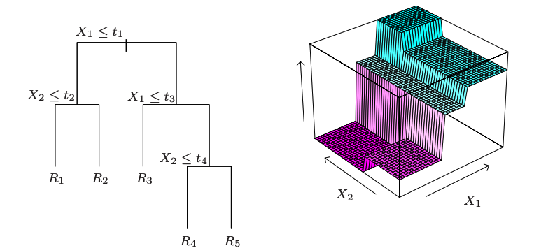
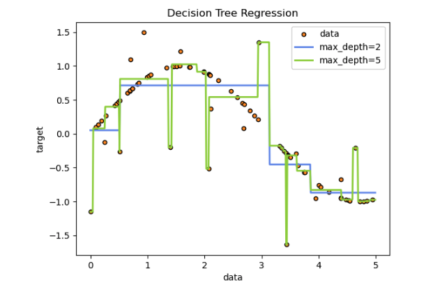
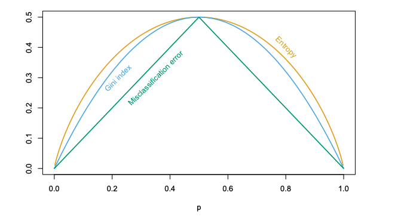

# Tree-Based Methods

## Introduction

Decision tree is a non-parametric supervised learning method utilized for classification and regression tasks. It has a hierarchical tree structure, which consists of a root node, internal nodes, and leaf nodes.

For example, in the figure below, the observations satisfying the condition at each conjunction are assigned to the left branch, and the others to the right branch. The terminal nodes or leaves of the tree correspond to the regions $R_1$, $R_2$, $R_3$, $R_4$, and $R_5$. For regression tree, the model predicts Y with a constant $c_m$ in region $R_m$. The right panel of the figure is a perspective plot of the regression surface from this model.

[Image source](https://hastie.su.domains/Papers/ESLII.pdf)

In the example below, decision trees learn from data to approximate a sine curve with a set of if-then-else decision rules. The deeper the tree, the more complex the decision rules and the fitter the model.

[Image source](https://scikit-learn.org/stable/modules/tree.html)

## Types of Decision Tree
### Regression Tree

Regression trees are decision trees in which the target variables can take continuous values instead of class labels in leaves.

Suppose we have dataset $D=\{(X_i, y_i), i=1,2,...N\}$ and we first partition the dataset into M regions $R_1, R_2, ..., R_M$. We model the response as a constant $c_m$ in each region:

$$
\begin{aligned}
f(X)=\sum_{m=1}^M c_m I\left(X \in R_m\right)
\end{aligned}
$$

However, if we adopt as our criterion minimization of the sum of squares $\sum(y_i - f(X_i))^2$, it is easy to
see that the best $\hat{c_m}$ is just the average of $y_i$ in region $R_m$: $\hat{c}_m=\operatorname{ave}\left(y_i \mid x_i \in R_m\right)$. As a result, finding the best binary partition in terms of minimum sum of squares is generally computationally infeasible. Hence we proceed with a greedy algorithm as follows:

Starting with all of the data, consider a splitting variable $j$ and split point $s$, and define the pair of half-planes:

$$
\begin{aligned}
R_1(j, s)=\{X \mid X_j \leq s\} \\
R_2(j, s)=\{X \mid X_j>s\}
\end{aligned}
$$ 

Then we seek the splitting variable $j$ and split point $s$ that solve:

$$
\begin{aligned}
\min _{j, s}\left[\min _{c_1} \sum_{x_i \in R_1(j, s)}\left(y_i-c_1\right)^2+\min _{c_2} \sum_{x_i \in R_2(j, s)}\left(y_i-c_2\right)^2\right]
\end{aligned}
$$ 

For any choice $j$ and $s$, the inner minimization is solved by:

$$
\begin{aligned}
\hat{c}_1=\operatorname{ave}\left(y_i \mid x_i \in R_1(j, s)\right) \\
\hat{c}_2=\operatorname{ave}\left(y_i \mid x_i \in R_2(j, s)\right)
\end{aligned}
$$ 

For each splitting variable, the determination of the split point $s$ can be done very quickly and hence by scanning through all of the inputs, determination of the best pair ($j,s$) is feasible.

Having found the best split, we partition the data into the two regions. Then this process is repeated on all of the resulting regions.

#### Tree Size Determination

How large should we grow the tree? A very large tree might overfit, while a small tree might underfit. Thus, figuring out the tree size is very important.

The preferred strategy is to grow a large tree and stop the splitting process when some minimum node size is reached. Then the large tree is pruned using `cost-complexity pruning`:

$$
\begin{aligned}
N_m=the\ number\ of\ data\ points\ within\ region\ m \\
\hat{c}_m=\frac{1}{N_m} \sum_{x_i \in R_m} y_i \\
Q_m(T)=\frac{1}{N_m} \sum_{x_i \in R_m}\left(y_i-\hat{c}_m\right)^2\\
C_\alpha(T)=\sum_{m=1}^{|T|} N_m Q_m(T)+\alpha|T|
\end{aligned} 
$$

Where:

* $\hat{c_m}$ - the constant value within region $m$
* $Q_m$ - the sum of squares of region $m$
* $T$ - the subtree 
* $|T|$ - the number of terminal nodes
* $C_\alpha$ - the cost-complexity
* $\alpha$ - tuning parameter governing the tradeoff between tree size and its goodness of fit to the data

To find $T_\alpha$ we use `weakest link pruning`. For more details, see Breiman et al.(1984) or Ripley(1996).

### Classification Tree

When the target is a classification outcome, the only changes needed in the tree algorithm pertain to the criteria for splitting nodes and pruning the tree. 

For regression we used the squared-error node impurity measure $Q_m(T)$, while in classfication tasks, we have the following three impurity measures:

`Misclassification Error`: $\frac{1}{N_m} \sum_{i \in R_m} I\left(y_i \neq k(m)\right)=1-\hat{p}_{m k(m)}$

`Gini Index`:

$$
\begin{aligned}
\sum_{k \neq k^{\prime}} \hat{p}_{m k} \hat{p}_{m k^{\prime}}=\sum_{k=1}^K \hat{p}_{m k}\left(1-\hat{p}_{m k}\right)
\end{aligned}
$$

`Cross-entropy (or Deviance)`: 

$$
\begin{aligned}
-\sum_{k=1}^K \hat{p}_{m k} \log \hat{p}_{m k}
\end{aligned}
$$

Where:

$$
\begin{aligned}
\hat{p}_{m k}=\frac{1}{N_m} \sum_{x_i \in R_m} I\left(y_i=k\right)
\end{aligned}
$$

standing for the proportion of majority class $k$ observations in node $m$.

[Image source](https://hastie.su.domains/Papers/ESLII.pdf)

As is shown above in the figure, three impurity measures are similar, but cross-entropy and the Gini index are differentiable, and hence more amenable to numerical optimization. 

Note that the Gini index and cross-entropy are more sensitive to changes in the node probabilities than the misclassification rate. For example, in a two-class problem with 400 observations in each class, suppose one split created nodes (300, 100) and (100, 300), while the other created nodes (200, 400) and (200, 0). Both splits produce a misclassification rate of 0.25, but the second split produces a pure node and is probably preferable. Both the Gini index and cross-entropy are lower for the second split. For this reason, either the Gini index or cross-entropy should be used when growing the tree. 

### Pros & Cons

#### Pros
* Instability - One major problem with trees is their high variance. Often a small change in the data can result in a very different series of splits, making interpretation somewhat precarious. The major reason for this instability is the hierarchical nature of the process: the effect of an error in the top split is propagated down to all of the splits below it. `Bagging` averages many trees to reduce this variance.

* Lack of smoothness - Another limitation of trees is the lack of smoothness of the prediction surface, as can be seen in the first figure above. The `MARS`(Multivariate Adaptive Regression Splines) procedure can be viewed as a modification of CART design to alleviate this lack of smoothness.

* Difficulty in capturing additive structure - In regression, suppose, for example, that $Y=c_1I(X_1 < t_1) + c_2I(X_2 < t_2) + \epsilon$ where $\epsilon$ is zero-mean noise. Then a binary tree might make its first split on $X_1$ near $t_1$. At the next level down it would have to split both nodes on $X_2$ at $t_2$ in order to capture the additive structure. This might happen with sufficient data, but the model is given no special encouragement to find such structure. Again the `MARS` method gives up this binary tree structure in order to capture additive structure.

#### Cons

* Easy interpretation: trees can be visualized.
* Requires little data preparation: other techniques often require data normalization, dummy variables need to be created and blank values to be removed(note however that scikit-learn decision tree module does not support missing values).
* The cost of using the tree is logarithmic in the number of data points used to train the tree.
* Able to handle both numerical and categorical data.
* Performs well even if its assumptions are somewhat violated by the true model from which the data were generated.

### References

https://hastie.su.domains/Papers/ESLII.pdf.

